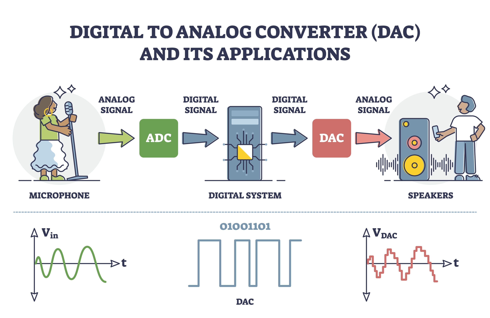

## Inhalte

* Signale (Klassifikation, Quantisierung)
* Signaltransformationen (A/D- und D/A-Wandlung)
* Übertragungssysteme (LTI-Systeme)
* Identifizierung des Übertragungsverhaltens (Impulsantwort)
* Modellierung mit Blockschaltbildern

---

## Wichtige Konzepte

### Definition Signal
Ein Signal ist die Darstellung einer Information durch eine **zeitveränderliche physikalische Größe** (z. B. Spannung, Strom). Die eigentliche Information wird durch einen Parameter dieser Größe kodiert (z. B. Amplitude, Frequenz, Phase).

### Signalklassifikation

Man unterscheidet Signale nach ihrem Verhalten über die Zeit und über ihren Wertebereich.

#### Deterministisch vs. Stochastisch
* **Deterministisch:** Der Signalverlauf ist analytisch beschreibbar.
    * *Periodisch* (wiederkehrend)
    * *Transient / Aperiodisch* (einmalig, abklingend)
* **Stochastisch:** Zufälliger Verlauf (z. B. Rauschen), nur statistisch beschreibbar.

#### Kontinuierlich vs. Diskret

Diese Attribute werden sowohl auf die **Zeitachse** ($t$) als auch auf den **Wertebereich** (Amplitude) angewandt:

| Attribut | Zeitachse ($t$) | Wertebereich (Amplitude) |
| :--- | :--- | :--- |
| **Kontinuierlich** | Signal ist zu *jedem* Zeitpunkt definiert. | Signal kann *jeden* beliebigen Zwischenwert annehmen ($\infty$ viele Werte). |
| **Diskret** | Signal ist nur zu *bestimmten* Zeitpunkten definiert (z.B. $t_k$). | Signal kann nur aus einem *begrenzten Vorrat* an Werten wählen (Stufen). |

#### Die 4 Signalklassen
Aus der Kombination ergeben sich vier Grundtypen:

1.  **Analoges Signal:** Zeit- und wertkontinuierlich (das physikalische Original).
2.  **Amplitudenquantisiertes Signal:** Zeitkontinuierlich, aber wertdiskret (Treppenfunktion).
3.  **Abtastsignal:** Zeitdiskret, aber wertkontinuierlich (Nadelimpulse mit exakter Höhe).
4.  **Digitales Signal:** Zeit- und wertdiskret (eine Folge von Zahlen/Bits).

---

### Signaltransformation
Beschreibt die Umwandlung zwischen den Signalklassen, insbesondere den Weg vom analogen Prozess zum digitalen Rechner und zurück.

#### A/D-Wandlung (Analog &rarr; Digital)
Der Prozess besteht aus zwei Hauptschritten:
1.  **Abtastung (Sampling):** Wandelt ein zeitkontinuierliches in ein zeitdiskretes Signal um (Analog $\to$ Abtastsignal).
2.  **Quantisierung:** Wandelt ein wertkontinuierliches in ein wertdiskretes Signal um. Dabei entsteht ein Quantisierungsfehler (Rauschen).

#### D/A-Wandlung (Digital &rarr; Analog)
1.  **Halteglied:** Wandelt die digitale Zahlenfolge meist in ein Treppensignal (Zeitkontinuierlich, wertdiskret).
2.  **Glättung/Interpolation:** Ein **Tiefpassfilter** rekonstruiert aus dem Treppensignal oder den Abtastwerten wieder ein glattes, wertkontinuierliches Signal.

> **Hinweis:** Über reale physikalische Medien (Kabel, Funk) können effektiv nur **Analogsignale** übertragen werden, da diese Medien immer eine Tiefpasswirkung und Dämpfung besitzen, die harte digitale Flanken "verschleift".

---

### Übertragungssysteme
Ein mathematisches Modell, das beschreibt, wie ein System eine **Ursache** (Eingang $s_1(t)$) in eine **Wirkung** (Ausgang $s_2(t)$) umwandelt.

In der Regelungstechnik betrachtet man meist **LTI-Systeme** (Linear, Time-Invariant):
* **Linear:** Es gilt das **Superpositionsprinzip**. Die Antwort auf eine Summe von Signalen ist gleich der Summe der einzelnen Antworten.
* **Zeitinvariant:** Das Systemverhalten ändert sich nicht über die Zeit (ein Experiment heute liefert das gleiche Ergebnis wie morgen).
* **Kausal:** Die Wirkung tritt nicht vor der Ursache ein.

---

### Identifikation des Übertragungsverhaltens

Wie findet man heraus, was ein System ("Black Box") tut? Man nutzt Testsignale.

#### Dirac-Impuls (δ(t))
Ein theoretisches Testsignal von unendlich kurzer Dauer und unendlich hoher Amplitude, aber definierter Fläche.
* Modell: Rechteckimpuls der Breite $2/\tau$ und Höhe $\tau/2$ (für $\tau \to \infty$).
* Fläche (Energie):
    
$$\text{Fläche} = \text{Breite} \times \text{Höhe} = \frac{2}{\tau} \times \frac{\tau}{2} = 1$$

#### Impulsantwort (h(t))

* Die Impulsantwort ist das Ausgangssignal eines Systems, wenn man am Eingang einen Dirac-Impuls $\delta(t)$ anlegt.
* **Bedeutung:** Bei einem LTI-System beschreibt $h(t)$ das Übertragungsverhalten **vollständig**. Kennt man $h(t)$, kann man die Reaktion auf *jedes* beliebige Eingangssignal berechnen (Faltung).

---

### Modellierung mit Blockschaltbildern
Komplexe dynamische Systeme werden durch die Verschaltung elementarer Blöcke dargestellt. Die Grundlage bilden physikalische Differentialgleichungen (DGL).

#### Beispiel: Masse-Feder-Dämpfer-System

{ style="width: 300px; display: block;" }

Ein mechanisches System 2. Ordnung. Es wirkt eine externe Kraft $F(t)$, während Trägheit, Federkraft und Dämpfung entgegenwirken.

* **Parameter:** Masse $m$, Federkonstante $c$, Dämpfungsfaktor $b$.
* **Reibungsmodell:** Hier z.B. Newton-Reibung (quadratisch zur Geschwindigkeit), was eine Nichtlinearität darstellt.
* **DGL:**

$$mx''(t) = F(t) - c \cdot x(t) - b \cdot \text{sign}(x'(t)) \cdot (x'(t))^2$$

*(Hinweis: $x(t)$ ist die Position, $x'(t)$ die Geschwindigkeit, $x''(t)$ die Beschleunigung).*

Dieses Modell kann direkt in Tools wie Simulink durch Integrator-Blöcke, Verstärkungs-Blöcke (Gain) und Summierer nachgebaut werden.